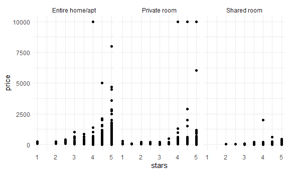
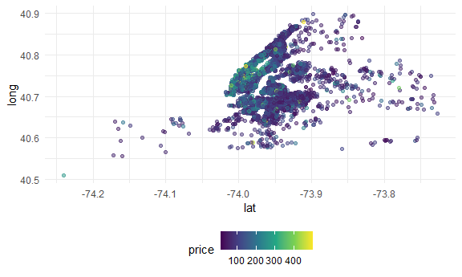

Case Study
================
Lynn Chen

## Load a dataset

``` r
data("nyc_airbnb")
```

Questions might be interested in askingabout this dataset: \* How many
rentals are there? Of what type? In what places? \* Is price correlated
with review score? \* Which neighborhood is most popular? Most
expensive? \* Which neighborhood has the highest reviews? \* Is
availability related to price? \* Is room type related to neighborhood?
\* Is length pf stay related to neighborhood group (borough)?

``` r
nyc_airbnb = 
  nyc_airbnb %>% 
  mutate(stars = review_scores_location / 2) %>%  ## From rating 1-10 to 1-5
  rename(borough = neighbourhood_group)
```

Let’s try to count things

``` r
nyc_airbnb %>% 
  count(borough, room_type) %>% 
  pivot_wider(
    names_from = room_type,
    values_from = n
  )
```

    ## # A tibble: 5 x 4
    ##   borough       `Entire home/apt` `Private room` `Shared room`
    ##   <chr>                     <int>          <int>         <int>
    ## 1 Bronx                       192            429            28
    ## 2 Brooklyn                   7427           9000           383
    ## 3 Manhattan                 10814           7812           586
    ## 4 Queens                     1388           2241           192
    ## 5 Staten Island               116            144             1

``` r
## using janior
nyc_airbnb %>% 
  janitor::tabyl(borough, room_type)
```

    ##        borough Entire home/apt Private room Shared room
    ##          Bronx             192          429          28
    ##       Brooklyn            7427         9000         383
    ##      Manhattan           10814         7812         586
    ##         Queens            1388         2241         192
    ##  Staten Island             116          144           1

Let’s look at price and room\_type…

``` r
nyc_airbnb %>% 
  ggplot(aes(x = stars, y = price)) +
  geom_point() +
  facet_grid(. ~ room_type)
```

    ## Warning: Removed 10037 rows containing missing values (geom_point).



Price and neighborhood

``` r
nyc_airbnb %>% 
  filter(borough == "Manhattan") %>% 
  group_by(neighbourhood) %>% 
  summarize(mean_price = mean(price, na.rm = TRUE)) %>% 
  arrange(mean_price)
```

    ## # A tibble: 32 x 2
    ##    neighbourhood       mean_price
    ##    <chr>                    <dbl>
    ##  1 Marble Hill               83.6
    ##  2 Inwood                    86.5
    ##  3 Washington Heights        90.1
    ##  4 Morningside Heights      107. 
    ##  5 Harlem                   117. 
    ##  6 Roosevelt Island         122. 
    ##  7 Two Bridges              123. 
    ##  8 East Harlem              128. 
    ##  9 Chinatown                158. 
    ## 10 Upper East Side          172. 
    ## # ... with 22 more rows

``` r
nyc_airbnb %>% 
  filter(borough == "Manhattan",
         price <= 1000) %>% 
  mutate(neighbourhood = fct_reorder(neighbourhood, price)) %>% 
  ggplot(aes(x = neighbourhood, y = price)) +
  geom_boxplot() +
  coord_flip() +
  facet_grid(.~room_type)
```


Price vs location

``` r
nyc_airbnb %>% 
  filter(price < 500) %>% 
  sample_n(5000) %>% ## large dataset telling r to take the sample size desired -- randomly
  ggplot(aes(x = lat, y = long, color = price)) +
  geom_point(alpha = 0.5)
```



## retry leaflet

``` r
pal = colorNumeric("viridis", NULL)

nyc_airbnb %>% 
  mutate(
    labels = str_c("<b>Price", price, "</b><br>Stars", stars)
  ) %>% view 

nyc_airbnb %>% 
  filter(price < 500) %>% 
  sample_n(1000) %>% 
  mutate(
    labels = str_c("<b> Price", price, "</b><br> Stars", stars)
  ) %>% 
  leaflet() %>% 
  addProviderTiles(providers$CartoDB.Positron) %>% 
  addCircleMarkers(~lat, ~long, radius = 1, popup = ~ labels, color = ~ pal(price)) 
```

This graphic isn’t static, it’s a html graphic. If want to publish
this–&gt; can’t knit this into github document, have to change to html.
